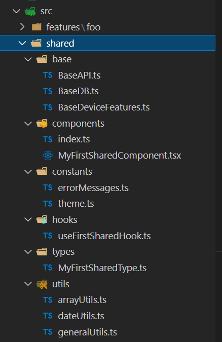

## React native boilerplate

### Base structure

- [Feature responsability - Article](https://ramonprata.medium.com/react-controle-de-estado-vamos-organizar-a065e0f5e82c)
- [Feature responsability - GitHub](https://github.com/ramonprata/structure_react_redux_app)

### Base Architecture

- **Changes**

  - FeatureService: **FeatureRepository**

- **Descriptions**

  - Each file describes its own purpose

    - _e.g_ `FooActions`

      

    - _e.g_ `FooRepository`

      

- **src**
  - **folders**
    
  - feature detail
    
  - shared detail
    
- **lint/formatter**
  - `.prettierrc.json`
  - `.eslintrc.json`
- **package.json**
  - **optional dependencies**
    - styled-components
  - **optional devDependencies**
    - @types/styled-components-react-native
- **.vscode**
  - `react-native-ts.code-snippets`
  - `settings.json`
